# Get Hung ...

... for the lamb, the sheep or the whole herd.
In this terminal based game of classic Hangman, the player tries to guess a word letter by letter before running out of lives and being sent to the gallows.

This project was built with Python3 as the "Python's Essentials" Project (portfolio project 3) for Code Insitute. 

[Link to live site](https://get-hung.herokuapp.com/)

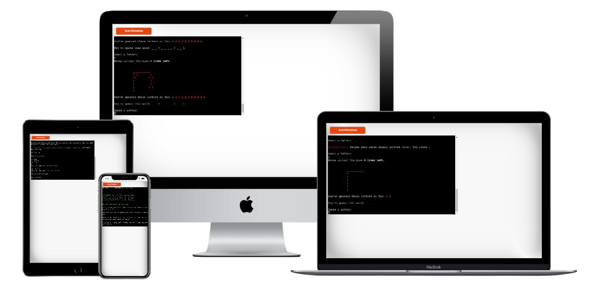


## Index - Table of Contents

- [Planning](#planning)

- [Design](#design)

- [UX](#ux)
    - [Programm Goals](#programm-goals)
    - [User Stories](#user-stories)

- [Features](#features)
    - [Existing Features](#existing-features)
    - [Future Features](#possible-future-features)

- [Bugs](#bugs)
    - [Fixed bugs](#fixed-bugs)
    - [Unfixed bugs](#unfixed-bugs)

- [Credits](#credits)
    - [Data](#data)
    - [Code](#code)
    - [Styling](#styling)


## Planning

The following flowchart (created with [daigrams.net](https://app.diagrams.net/)) visualizes the planning process for this application.

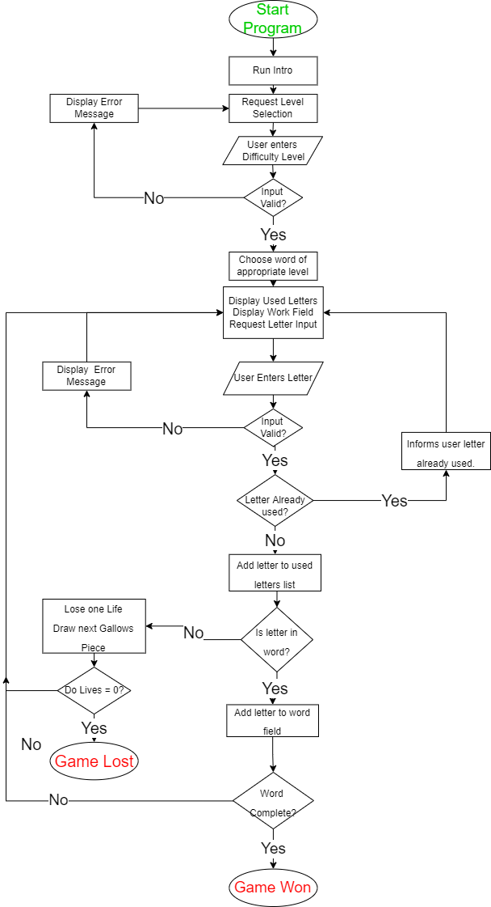


## Design

As this is simple terminal based application, the design process for the user interface was limited.

Different colour choices and bold text are used in order to highlight and categorise messages to the user.

For example, error messages and wrong guesses are displayed in red, as is the gallows graphics to signify a negative event.
The word itself is displayed green for every correct guess.
General information, such as already guessed letters, is either displayed in yellow or simply bold.

Emojis are used in the introduction and termination of the game (both won or lost) to make up for the general lack of images.


## UX

### Programm Goals

The goal of this programm is to provide the user with a simple, easy to understand and play game of hangman that can be played multiple times without the challenge being repeated.

### User Stories

**As a user I want to**

- be able to read an introduction when first loading the programm
- read the rules to the game in short and consice text
- choose a difficulty level
- know how many lives I start off with
- be informed if my data input is not valid and why
- see which letters I have already guessed
- see the word being displayed for every correct guess
- be informed how many lives I have left after a wrong guess
- see a graphic visualising my lost lives
- learn the word to be guessed after losing the game
- see the full word displayed after completing the game successfully
- know when the game is over (won or lost)

**As a site administrator I want to**

- be able to make modifications to the game (see [future features](#possible-future-features))
- offer the user a short yet entertaining game


## Features

### Existing Features

**Logo**
- Displays game title using ASCII

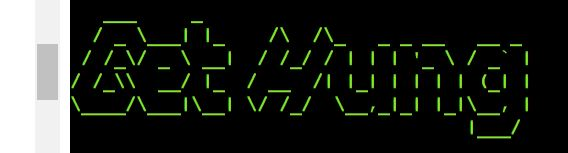

**Introduction and Rules**
- Gives the user a brief run through the game and how to play it

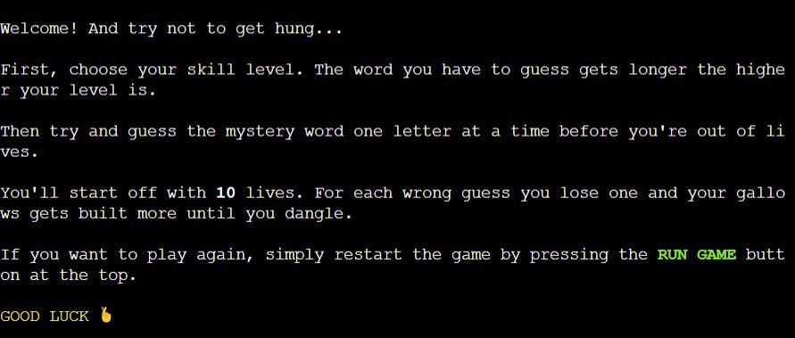

**Level choice**
- Allows user to choose one of three difficulty levels

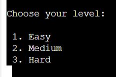

**Invalid Data Error**
- Informs the user if input data was not valid
- Tells the user which data type is required and what was typed incorrectly
- Displays for invalid level and letter input

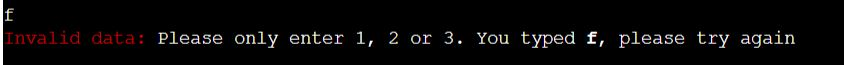

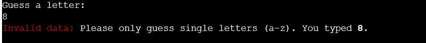

**Used letters display**
- Lists the letters that the user has guessed

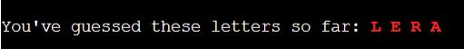

**Duplicated letter message**
- Informs the user when a letter guess is duplicate
- Tell user to guess a different letter

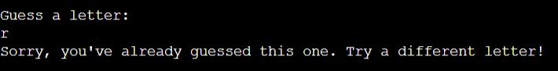

**Word display**
- Displays all correctly guessed letters
- Gradually builds entire word

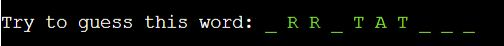

**Lives count**
- Informs user of remaining lives after each wrong guess

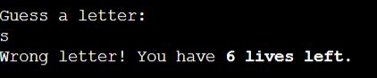

**Gallows graphics**
- Visualises the loss of live by adding a section to the gallows graphics for each wrong guess

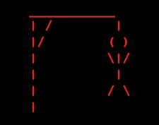

**Game won message**
- Informs and congratulates user when game is won
- Shows after fully displayed word

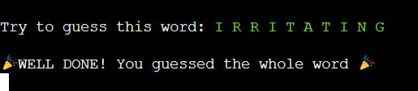

**Game lost message**
- Informs user when game is lost
- Reveals to user the word that was to be guessed

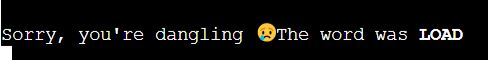


### Possible Future Features

**Typing effect**
- Will type out print statements in terminal letter by letter to mimic type writer effect

**Single display game progression**
- Game progression will show in terminal as progressively building a single display
- This will prevent a continues flow of output and down-scrolling


## Bugs

### Fixed Bugs

**Word not displaying fully when game won**:

After entering the last letter of the fully guessed word, the last letter is not added to the word display. Therefore the finished word doesn't display properly.

*Solution*:

Run display_word function again when condition for game completion is met:
```
elif len(word_letters) == 0:
    display_word()
    print("🎉 Well done! You guessed the whole word 🎉")
```

### Unfixed Bugs

No unfixed bugs to date.

## Credits

### Data

- **Word List**: 

    [This list](https://www.randomlists.com/data/words.json) was used as supplied by [this StackOverflow post](https://stackoverflow.com/questions/594273/how-to-pick-a-random-english-word-from-a-list)

    Using MS Word I manually removed all words containing "-" to simplify the game functionality. Also, I adapted the spelling to UK English where it originally differed. 

- **Logo**:

    [Text to ASCII Art Generator](https://patorjk.com/software/taag/#p=display&f=Graffiti&t=Type%20Something%20)

    Font: Ogre.


### Code

- **Hangman Game**

    [Tutorial by Kylie Ying](https://www.youtube.com/watch?v=8ext9G7xspg&t=1465s)

    Code was adapted to meet granular function criteria

- **Hangman ascii visualisation**

    Taken from [tutorial repo](https://github.com/kying18/hangman/blob/master/hangman_visual.py)


### Styling

- **Colours**

    Built-in module [Colorama](https://github.com/techwithtim/ColoredTextInPython/blob/main/main.py)

- **Timing**

    [time module](https://www.freecodecamp.org/news/the-python-sleep-function-how-to-make-python-wait-a-few-seconds-before-continuing-with-example-commands/#:~:text=Make%20your%20time%20delay%20specific,after%20a%20slight%20delay.%22) and sleep() function